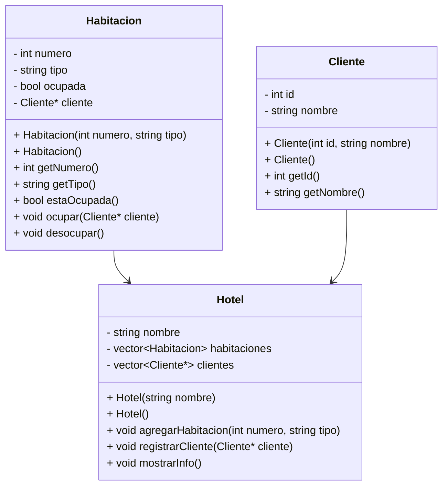
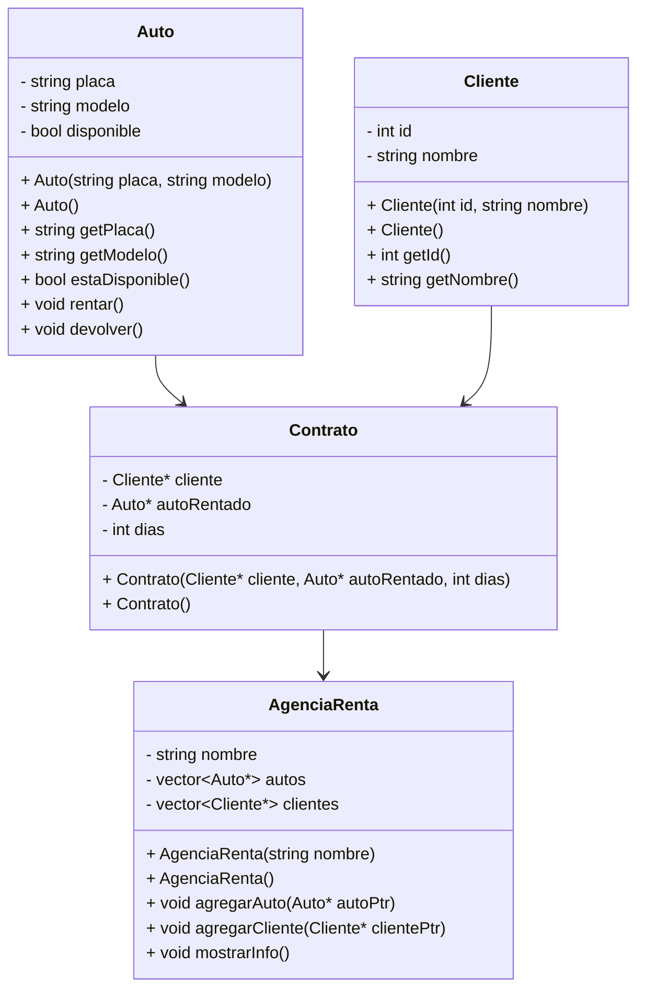

```mermaid
classDiagram
    class Hotel {
        - string nombre
        - vector~Habitacion~ habitaciones
        - vector~Cliente*~ clientes
        + Hotel(string nombre)
        + Hotel()
        + void agregarHabitacion(int numero, string tipo)
        + void registrarCliente(Cliente* cliente)
        + void mostrarInfo()
    }

    class Habitacion {
        - int numero
        - string tipo
        - bool ocupada
        - Cliente* cliente
        + Habitacion(int numero, string tipo)
        + Habitacion()
        + int getNumero()
        + string getTipo()
        + bool estaOcupada()
        + void ocupar(Cliente* cliente)
        + void desocupar()
    }

    class Cliente {
        - int id
        - string nombre
        + Cliente(int id, string nombre)
        + Cliente()
        + int getId()
        + string getNombre()
    }
Habitacion --> Hotel
Cliente --> Hotel
```

```mermaid
classDiagram
    class AgenciaRenta {
        - string nombre
        - vector~Auto*~ autos
        - vector~Cliente*~ clientes
        + AgenciaRenta(string nombre)
        + AgenciaRenta()
        + void agregarAuto(Auto* autoPtr)
        + void agregarCliente(Cliente* clientePtr)
        + void mostrarInfo()
    }

    class Auto {
        - string placa
        - string modelo
        - bool disponible
        + Auto(string placa, string modelo)
        + Auto()
        + string getPlaca()
        + string getModelo()
        + bool estaDisponible()
        + void rentar()
        + void devolver()
    }

    class Cliente {
        - int id
        - string nombre
        + Cliente(int id, string nombre)
        + Cliente()
        + int getId()
        + string getNombre()
    }

    class Contrato {
        - Cliente* cliente
        - Auto* autoRentado
        - int dias
        + Contrato(Cliente* cliente, Auto* autoRentado, int dias)
        + Contrato()
    }

Auto --> Contrato
Cliente --> Contrato
Contrato --> AgenciaRenta
```
